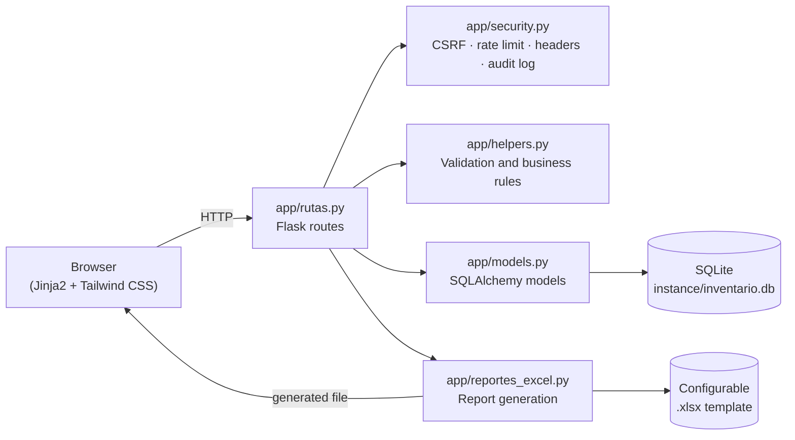

# Sistema de Inventario TI · IT Inventory Management System

<p align="left">
  
  
  
  
  
  
</p>

Aplicación web full-stack construida con Flask para administrar el ciclo de vida de activos de TI: alta, búsqueda, edición, eliminación y generación de reportes en Excel.

Full-stack web application built with Flask to manage the entire lifecycle of IT assets: creation, search, editing, deletion, and Excel report generation.

**🇪🇸 [Español](#español-1)** · **🇬🇧 [English](#english-1)**

> **Nota de portafolio / Portfolio note:** este repositorio es una versión pública y generalizada de un sistema desarrollado originalmente para uso interno. Los nombres de sistemas, catálogos y campos de "sistemas especializados" son configurables por variables de entorno y aquí se muestran con valores genéricos (`Sistema A`, `ERP`, `Mesa de ayuda`, etc.), sin datos, plantillas ni información de ninguna organización real. // This repository is a public, generalized version of a system originally built for internal use. "Specialized system" names, catalogs, and fields are environment-configurable and shown here with generic placeholder values (`System A`, `ERP`, `Helpdesk`, etc.), with no real organization's data, templates, or information included.

---

## Tabla de contenido / Table of contents

- [Español](#español-1)
  - [Descripción](#descripción)
  - [Arquitectura](#arquitectura)
  - [Funcionalidades](#funcionalidades)
  - [Tecnologías](#tecnologías)
  - [Requisitos](#requisitos)
  - [Instalación paso a paso](#instalación-paso-a-paso)
  - [Configuración](#configuración)
  - [Ejecución](#ejecución-en-desarrollo)
  - [Uso del sistema](#uso-del-sistema)
  - [Reportes Excel](#reportes-excel)
  - [Seguridad implementada](#seguridad-implementada)
  - [Privacidad y datos locales](#datos-y-archivos-locales)
  - [Estructura del proyecto](#estructura-del-proyecto)
  - [Pruebas](#pruebas)
  - [Problemas comunes](#problemas-comunes)
  - [Posibles mejoras futuras](#posibles-mejoras-futuras)
- [English](#english-1)
  - [Description](#description)
  - [Architecture](#architecture)
  - [Features](#features)
  - [Tech stack](#tech-stack)
  - [Requirements](#requirements)
  - [Step-by-step installation](#step-by-step-installation)
  - [Configuration](#configuration-1)
  - [Running the app](#development-run)
  - [Application usage](#application-usage)
  - [Excel reports](#excel-reports-1)
  - [Implemented security](#implemented-security)
  - [Local data and privacy](#local-files)
  - [Project structure](#project-structure)
  - [Testing](#testing)
  - [Troubleshooting](#troubleshooting)
  - [Roadmap](#roadmap)
- [Licencia / License](#licencia--license)

---

## Español

### Descripción

Sistema web de inventario TI orientado a registrar, consultar, editar y reportar activos tecnológicos asignados a responsables internos. La aplicación centraliza información de responsables, equipos, ubicaciones físicas, especificaciones de cómputo, red, software instalado y accesos a sistemas configurables.

El proyecto está desarrollado con Flask, SQLite, Flask-SQLAlchemy, Jinja2, Tailwind CSS y openpyxl. Incluye una interfaz operativa para altas, búsquedas, edición en modal, eliminación con confirmación y generación de reportes Excel respetando una plantilla configurable.

El repositorio público está preparado para portafolio y reutilización: incluye código fuente, plantilla demo, configuración de ejemplo y documentación de instalación. Los datos reales, la configuración local, la base de datos y plantillas privadas se mantienen fuera del repositorio mediante `.gitignore`.

### Arquitectura

La aplicación sigue el patrón *application factory* de Flask, con responsabilidades separadas por módulo:


| Módulo | Responsabilidad |
|---|---|
| `app/__init__.py` | Application factory: crea la app, valida configuración riesgosa, registra seguridad, rutas y catálogos base. |
| `app/config.py` | Carga de configuración desde variables de entorno (`.env`). |
| `app/models.py` | Modelos SQLAlchemy: `Responsable`, `Activo`, `DetalleComputo`, `TipoActivo`, `Posicion`. |
| `app/rutas.py` | Endpoints HTTP: listado/filtros, alta, edición, eliminación, APIs de autocompletado/validación y reportes. |
| `app/helpers.py` | Normalización de texto, límites de campo, reglas de creación/reutilización de catálogos y responsables. |
| `app/security.py` | CSRF, rate limiting, allowlist de host/IP, headers defensivos, bitácora de auditoría, manejo de errores. |
| `app/reportes_excel.py` | Generación de reportes `.xlsx` preservando estilos, celdas combinadas y recursos embebidos de la plantilla. |

### Funcionalidades

#### Gestión De Inventario

- Alta de activos de TI con responsable, tipo, marca, modelo, número de serie, número de activo, accesorio, clasificación y ubicación.
- Registro de especificaciones técnicas: procesador, IPv4, MAC address, RAM, almacenamiento, capacidad, nombre de máquina y sistema operativo.
- Registro de software y configuración: Office, antivirus, lector PDF, navegadores, compresor, videoconferencia, drivers de impresora, dominio, VPN, usuario de directorio y usuario de correo.
- Registro de sistemas especializados mediante campos configurables por variables de entorno.
- Soporte para activos sin responsable o sin número de activo usando el valor operativo `No aplica`.
- Relación entre responsable y múltiples activos.

#### Automatización Y Experiencia De Uso

- Autollenado de responsable al escribir número de empleado.
- Autollenado de responsable al escribir nombre.
- Bloqueo de campos del responsable cuando ya existe en la base, evitando modificar accidentalmente datos compartidos por otros activos.
- Validación en vivo del número de activo mediante API antes de guardar.
- Prevención de guardado si el número de activo ya existe, excepto cuando el valor es `No aplica`.
- Creación dinámica de nuevos tipos de activo desde el formulario.
- Creación dinámica de nuevas ubicaciones o posiciones desde el formulario.
- Modal de edición con modo lectura inicial y activación explícita de edición.
- Confirmación visual al crear, modificar o eliminar registros.
- Conservación de filtros al crear, editar o eliminar.
- Restauración de posición de scroll después de editar o eliminar.
- Resaltado visual de la fila afectada después de crear o modificar.

#### Consulta Y Filtrado

- Tabla principal de activos con responsable, tipo, marca/modelo, número de serie y ubicación.
- Búsqueda por nombre del responsable, número de empleado o número de serie.
- Filtro por tipo de activo.
- Filtro por ubicación o posición.
- Ordenamiento de activos por número de empleado y tipo de activo, dejando registros sin responsable real al final.

#### Reportes Excel

- Generación de reportes Excel descargables desde la aplicación.
- Filtros de reporte por responsable, tipo de activo y ubicación.
- Reporte completo cuando no se seleccionan filtros.
- Descarga asincrónica con estados visuales: generando, éxito, sin resultados y error.
- Generación basada en plantilla `.xlsx` configurable.
- Conservación de estilos, bordes, formatos, altura de fila, celdas combinadas relevantes, logo y recursos embebidos de la plantilla.
- Nombre de archivo con timestamp para facilitar trazabilidad.

#### Configuración, Privacidad Y Seguridad

- Configuración por variables de entorno mediante `.env`.
- Archivo `.env.example` listo para nuevas instalaciones.
- Separación entre versión pública y archivos privados locales.
- Exclusión de base de datos local, plantilla real, logs, respaldos y entorno virtual.
- Protección CSRF en formularios y acciones `POST`.
- Headers HTTP defensivos.
- Rate limit básico por IP y endpoint.
- Restricción opcional por host permitido.
- Restricción opcional por IP o subred cliente.
- Bitácora local de acciones modificadoras sin guardar contenido de formularios.
- Normalización de texto y límites de longitud para campos de entrada.
- Validación segura de la ruta de plantilla Excel.
- Rollback automático de sesión de base de datos ante errores.

### Tecnologías

| Tecnología | Rol en el proyecto | Por qué se eligió |
|---|---|---|
| **Python 3.10+** | Lenguaje principal del backend. | Ecosistema maduro para web y manejo de archivos (Excel), sintaxis clara para lógica de negocio. |
| **Flask** | Microframework web: define rutas, maneja requests/responses y renderiza plantillas. | Ligero y explícito: no impone estructura, lo que encaja con un proyecto de tamaño medio donde se prefiere controlar cada capa (seguridad, validación, reportes) a mano. |
| **Flask-SQLAlchemy** | ORM: mapea las clases Python (`Responsable`, `Activo`, etc.) a tablas SQL sin escribir SQL crudo. | Reduce errores de sintaxis SQL y facilita cambiar de motor de base de datos en el futuro si el proyecto crece. |
| **SQLite** | Motor de base de datos embebido; el archivo `instance/inventario.db` contiene toda la información. | No requiere instalar ni administrar un servidor de base de datos aparte; suficiente para el volumen de datos de un inventario departamental. |
| **Jinja2** | Motor de plantillas de Flask; genera el HTML final combinando datos del backend con `app/templates/`. | Viene integrado con Flask, soporta herencia de plantillas y lógica de presentación (loops, condicionales) sin mezclar demasiado con Python. |
| **HTML5** | Estructura semántica de las vistas. | Base estándar de cualquier interfaz web. |
| **Tailwind CSS** | Framework de utilidades CSS para estilos, layout responsivo y estados visuales (hover, focus, animaciones de confirmación). | Permite construir una interfaz consistente rápidamente sin escribir hojas de estilo extensas ni mantener nombres de clases personalizadas. |
| **JavaScript (vanilla)** | Interactividad en el navegador: autollenado de responsable, validación en vivo del número de activo, modales de edición/eliminación, descarga asíncrona de reportes. | Evita la sobrecarga de un framework de frontend (React/Vue) para una interfaz de formularios y tablas relativamente contenida. |
| **openpyxl** | Librería Python para leer y escribir archivos `.xlsx`, usada para generar los reportes preservando la plantilla. | Permite manipular celdas combinadas, estilos y recursos embebidos (como el logo) de un archivo Excel real, no solo exportar datos planos. |
| **python-dotenv** | Carga variables desde `.env` al entorno de ejecución. | Separa configuración sensible/variable (claves, rutas, nombres de campos) del código fuente versionado. |
| **Waitress** | Servidor WSGI de producción usado por `serve.py` para exponer la app en red interna. | Alternativa multiplataforma (funciona bien en Windows) al servidor de desarrollo de Flask, que no está pensado para tráfico real. |

### Requisitos

- **Python 3.10 o superior**: motor de ejecución del backend. Sin esto no se puede instalar ninguna dependencia ni arrancar el servidor.
- **pip**: gestor de paquetes de Python, se instala automáticamente junto con Python. Se usa para instalar Flask y el resto de librerías del `requirements.txt`.
- **Git** (opcional): solo necesario si vas a clonar el repositorio desde GitHub en lugar de descargarlo como `.zip`.
- **PowerShell en Windows**: todos los comandos de esta guía están escritos para PowerShell (no CMD ni Git Bash), ya que es la terminal que trae Windows por defecto.
- **Navegador web moderno**: Chrome, Edge o Firefox recientes. La interfaz usa Tailwind CSS y JavaScript estándar, sin requerir plugins.
- **~50 MB de espacio libre en disco**: para el entorno virtual (`venv/`) y las dependencias instaladas.

Verifica que Python esté instalado y accesible desde la terminal:

```powershell
python --version
```

Debe mostrar algo como `Python 3.11.4`. Si en cambio aparece un error como `python no se reconoce como un comando`, revisa la sección [Problemas comunes](#problemas-comunes): normalmente significa que Python no está en el `PATH` del sistema.

Verifica Git (solo si vas a clonar el repositorio):

```powershell
git --version
```

Si no tienes Git instalado y no quieres instalarlo, puedes descargar el proyecto como archivo `.zip` desde GitHub (botón `Code` → `Download ZIP`) y descomprimirlo manualmente; en ese caso omite el paso 1 de clonado y continúa desde el paso 2 dentro de la carpeta descomprimida.

### Instalación Paso A Paso

**1. Clona el repositorio**

```powershell
git clone https://github.com/Marco2004/sistema-inventario-ti-it-inventory-system.git
cd sistema-inventario-ti-it-inventory-system
```

Esto descarga el código fuente a tu PC y te posiciona dentro de la carpeta del proyecto. Todos los comandos siguientes deben ejecutarse desde ahí.

**2. Crea el entorno virtual**

```powershell
python -m venv venv
```

Un entorno virtual (`venv`) es una copia aislada de Python solo para este proyecto. Evita que las librerías de este sistema (Flask, SQLAlchemy, etc.) choquen con otras versiones instaladas globalmente en tu PC, y hace que el proyecto sea reproducible en otra máquina. Este paso crea una carpeta `venv/` nueva; no se sube al repositorio.

**3. Activa el entorno virtual en PowerShell**

```powershell
Set-ExecutionPolicy -Scope Process -ExecutionPolicy RemoteSigned ; .\venv\Scripts\Activate.ps1
```

`Set-ExecutionPolicy -Scope Process` permite ejecutar el script de activación solo en esta ventana de terminal, sin cambiar la configuración de seguridad del resto del sistema. Cuando el entorno esté activo, verás `(venv)` al inicio de la línea de comandos, por ejemplo:

```text
(venv) PS C:\Users\tuusuario\sistema-inventario-ti>
```

Debes repetir este paso de activación **cada vez que abras una terminal nueva** para trabajar en el proyecto; no es un paso único.

**4. Instala las dependencias**

```powershell
pip install -r requirements.txt
```

Este comando lee `requirements.txt` y descarga/instala automáticamente Flask, Flask-SQLAlchemy, openpyxl, python-dotenv y Waitress (con las versiones mínimas indicadas) dentro del entorno virtual activo. Solo necesitas repetirlo si vuelves a crear el `venv` desde cero o si el archivo `requirements.txt` cambia. Al finalizar sin errores, deberías poder confirmar que Flask quedó instalado:

```powershell
python -c "import flask; print(flask.__version__)"
```

**5. Crea tu archivo de configuración local**

```powershell
copy .env.example .env
```

`.env.example` es la plantilla pública de configuración (sin datos sensibles). Este comando crea una copia llamada `.env`, que es la que realmente usa la aplicación y que **nunca se sube al repositorio** (está excluida por `.gitignore`).

**6. Edita `.env` y cambia al menos `SECRET_KEY`**

Abre `.env` con cualquier editor de texto (Bloc de notas, VS Code, etc.) y reemplaza el valor de ejemplo de `SECRET_KEY` por uno propio. Puedes generar una clave aleatoria segura con:

```powershell
python -c "import secrets; print(secrets.token_hex(32))"
```

Copia el resultado como valor de `SECRET_KEY`. Para uso puramente local (`APP_ENV=development`) basta con cualquier valor distinto al de ejemplo; para `APP_ENV=server` o `APP_ENV=production` es obligatorio que sea una clave privada, larga y única — la aplicación se niega a iniciar en esos modos si detecta una clave insegura o de ejemplo (ver [Configuración](#configuración) para el resto de variables).

**7. Arranca el sistema**

```powershell
python run.py
```

Si todo está correcto, la terminal mostrará un mensaje indicando que el servidor de desarrollo de Flask está escuchando en `127.0.0.1:5000`, y quedará "corriendo" en esa ventana (no regresa el símbolo de sistema hasta que lo detengas). La primera vez que arranca, si `instance/inventario.db` no existe, la aplicación la crea automáticamente con las tablas necesarias.

**8. Abre el navegador**

```text
http://127.0.0.1:5000
```

Deberías ver la tabla principal de activos, vacía en una instalación nueva, junto con los botones `+ Nuevo Activo` y `Crear Reporte`. Si la página no carga, confirma que la terminal siga mostrando el proceso activo (paso 7) y que no haya un firewall bloqueando el puerto `5000` en `localhost`.

Para detener el servidor, presiona `Ctrl + C` en la terminal donde está corriendo.

**Instalación en un vistazo**

```text
git clone ...            → descarga el código
python -m venv venv      → crea entorno aislado
Activate.ps1             → activa el entorno (repetir cada sesión)
pip install -r ...       → instala dependencias
copy .env.example .env   → crea configuración local privada
editar .env              → define SECRET_KEY propia
python run.py            → arranca el servidor
http://127.0.0.1:5000    → abre la aplicación
```

### Configuración

El proyecto usa variables de entorno para separar el código de la configuración de cada instalación. El archivo público `.env.example` funciona como plantilla; el archivo real `.env` es privado y no debe subirse al repositorio.

Variables principales:

| Variable | Uso | Ejemplo |
|---|---|---|
| `SECRET_KEY` | Clave local usada por Flask para sesiones y firmas internas. Debe cambiarse en cada instalación. | `SECRET_KEY=cambia-esta-clave` |
| `APP_ENV` | Entorno de ejecución. Usa `development` en local y `server` o `production` en servidor. | `development` |
| `FLASK_DEBUG` | Activa o desactiva modo debug. En desarrollo puede ser `true`; para uso normal, `false`. | `FLASK_DEBUG=false` |
| `SERVER_HOST` | IP donde escucha la app. En local usa `127.0.0.1`; en red interna puede usarse la IP del servidor o `0.0.0.0`. | `127.0.0.1` |
| `SERVER_PORT` | Puerto de escucha. | `5000` |
| `ALLOWED_HOSTS` | Hosts o IPs permitidos en el encabezado HTTP `Host`. Vacío desactiva esta validación. | `127.0.0.1,localhost` |
| `CLIENT_IP_ALLOWLIST` | IPs o subredes permitidas a nivel aplicación. Vacío desactiva esta validación. | `192.168.1.10,192.168.1.0/24` |
| `MAX_CONTENT_LENGTH` | Tamaño máximo permitido para requests entrantes, en bytes. | `2097152` |
| `SESSION_COOKIE_SAMESITE` | Política SameSite de la cookie de sesión. | `Lax` |
| `SESSION_COOKIE_SECURE` | Marca la cookie como segura para HTTPS. En local suele ser `false`; en HTTPS debería ser `true`. | `false` |
| `RATE_LIMIT_ENABLED` | Activa o desactiva el límite básico de solicitudes. | `true` |
| `RATE_LIMIT_WINDOW_SECONDS` | Ventana de tiempo del rate limit, en segundos. | `60` |
| `RATE_LIMIT_MAX_REQUESTS` | Solicitudes máximas por IP y endpoint dentro de la ventana. | `240` |
| `AUDIT_LOG_ENABLED` | Activa o desactiva la bitácora local de acciones modificadoras. | `true` |
| `AUDIT_LOG_PATH` | Ruta del archivo de auditoría dentro de `instance/`. | `security_audit.log` |
| `AUDIT_LOG_MAX_BYTES` | Tamaño máximo del audit log antes de rotarlo a `<archivo>.1`. `0` desactiva la rotación. | `5242880` |
| `REPORT_TEMPLATE_PATH` | Ruta de la plantilla Excel usada para reportes. | `app/static/formato_reporte_demo.xlsx` |
| `REPORT_SHEET_NAME` | Nombre de la hoja dentro de la plantilla Excel. | `Equipo_Inventario` |
| `APP_TITLE` | Título mostrado en la interfaz. | `Inventario TI` |
| `SPECIALIZED_SYSTEMS_TITLE` | Encabezado de la sección de sistemas configurables. | `Sistemas Especializados` |
| `LABEL_*` | Etiquetas visibles para campos configurables. | `LABEL_SYSTEM_A=Sistema A` |
| `BASE_POSITIONS` | Ubicaciones iniciales separadas por coma. | `Area 1,Area 2,SITE` |
| `COL_*` | Nombres de columnas usados por la base de datos para campos configurables. | `COL_SYSTEM_A=system_a` |

Ejemplo mínimo recomendado para uso demo:

```env
SECRET_KEY=cambia-esta-clave-en-tu-pc
APP_ENV=development
FLASK_DEBUG=false
SERVER_HOST=127.0.0.1
SERVER_PORT=5000
ALLOWED_HOSTS=
CLIENT_IP_ALLOWLIST=
MAX_CONTENT_LENGTH=2097152
SESSION_COOKIE_SAMESITE=Lax
SESSION_COOKIE_SECURE=false
RATE_LIMIT_ENABLED=true
RATE_LIMIT_WINDOW_SECONDS=60
RATE_LIMIT_MAX_REQUESTS=240
AUDIT_LOG_ENABLED=true
AUDIT_LOG_PATH=security_audit.log
AUDIT_LOG_MAX_BYTES=5242880
REPORT_TEMPLATE_PATH=app/static/formato_reporte_demo.xlsx
REPORT_SHEET_NAME=Equipo_Inventario
APP_TITLE=Inventario TI
SPECIALIZED_SYSTEMS_TITLE=Sistemas Especializados
LABEL_HELPDESK_SYSTEM=Mesa de ayuda
LABEL_SYSTEM_A=Sistema A
LABEL_SYSTEM_B=Sistema B
LABEL_SYSTEM_C=Sistema C
LABEL_MESSAGING_SYSTEM=Mensajeria
LABEL_ERP_SYSTEM=ERP
LABEL_LEARNING_PLATFORM=E-learning
LABEL_QUALITY_SYSTEM=Gestion de calidad
LABEL_INTERNAL_DATABASE=Base de datos interna
BASE_POSITIONS=Area 1,Area 2,Administracion,Gerencia,SITE
COL_HELPDESK_SYSTEM=helpdesk_system
COL_SYSTEM_A=system_a
COL_SYSTEM_B=system_b
COL_SYSTEM_C=system_c
COL_MESSAGING_SYSTEM=messaging_system
COL_ERP_SYSTEM=erp_system
COL_LEARNING_PLATFORM=learning_platform
COL_QUALITY_SYSTEM=quality_system
COL_INTERNAL_DATABASE=internal_database
```

### Ejecución En Desarrollo

Para desarrollo local usa:

```powershell
python run.py
```

Este modo usa el servidor integrado de Flask y es cómodo para probar cambios. No se recomienda para servir la aplicación a varias PCs.

### Ejecución En Servidor Interno

Para una red interna en Windows se incluye `serve.py`, que usa Waitress como servidor WSGI:

```powershell
python serve.py
```

Ejemplo de configuración `.env` para servidor interno:

```env
APP_ENV=server
FLASK_DEBUG=false
SERVER_HOST=0.0.0.0
SERVER_PORT=5000
ALLOWED_HOSTS=127.0.0.1,localhost,192.168.1.50
CLIENT_IP_ALLOWLIST=192.168.1.10,192.168.1.11,192.168.1.0/24
SESSION_COOKIE_SECURE=false
```

Notas:

- `SERVER_HOST=0.0.0.0` permite que la app escuche conexiones desde otras PCs.
- `SERVER_PORT=5000` define el puerto que deberás permitir en firewall.
- `ALLOWED_HOSTS` debe incluir la IP o nombre usado para entrar al sistema.
- `CLIENT_IP_ALLOWLIST` agrega una segunda capa de restricción por IP o subred.
- El control principal de acceso debe hacerse en firewall/router permitiendo el puerto solo a las PCs autorizadas.
- Si se publica por HTTPS, cambia `SESSION_COOKIE_SECURE=true`.

### Uso Del Sistema

La interfaz está pensada para que una sola persona (por ejemplo, soporte técnico o TI) pueda dar de alta y mantener el inventario sin necesidad de conocimientos técnicos previos. A continuación se describe el flujo completo con el detalle de lo que ocurre en pantalla en cada paso.

#### Pantalla Principal

Al entrar, la aplicación muestra una tabla con todos los activos registrados: responsable, tipo, marca/modelo, número de serie y ubicación. En la parte superior están la barra de búsqueda, los filtros (tipo de activo y ubicación), el botón `+ Nuevo Activo` y el botón `Crear Reporte`. La tabla se actualiza sin recargar la página completa en la mayoría de las acciones (crear, editar, eliminar), lo que evita perder la posición de scroll o los filtros activos.

#### Registrar Un Activo

1. Entra a `http://127.0.0.1:5000`.
2. Haz clic en `+ Nuevo Activo`. Se abre un formulario modal sobre la misma pantalla, sin navegar a otra página.
3. Captura el número de empleado o el nombre del responsable.
4. Si el responsable ya existe en la base, el sistema autollena automáticamente nombre, extensión, departamento y puesto en cuanto detecta la coincidencia (sin necesidad de presionar ningún botón adicional).
5. Cuando el responsable ya existe, esos campos quedan bloqueados (solo lectura) para evitar cambios accidentales que afectarían a todos los demás activos de esa misma persona. Si necesitas corregir un dato del responsable, debe hacerse de forma intencional editando cualquiera de sus activos existentes.
6. Llena los datos básicos del activo: tipo, marca, modelo, número de serie, número de activo, accesorio, clasificación y ubicación.
7. Si el tipo de activo no existe todavía en el catálogo, selecciona `Otro` en el desplegable y escribe el nuevo tipo; quedará disponible para futuros registros sin necesidad de configurarlo antes.
8. Si la ubicación no existe, selecciona `Otra` y escribe la nueva posición; ocurre lo mismo, se agrega al catálogo para reutilizarse después.
9. Llena las especificaciones técnicas (procesador, RAM, almacenamiento, IPv4, MAC, nombre de máquina, sistema operativo), software instalado y los sistemas especializados configurados para tu instalación.
10. Mientras escribes el número de activo, el sistema consulta en segundo plano si ya existe. Si el número está repetido, aparece una alerta visual y el botón de guardado se deshabilita hasta corregirlo (excepto si el valor es `No aplica`, que sí permite duplicados).
11. Presiona `Guardar`. El modal se cierra, la tabla se actualiza, la fila nueva se resalta brevemente y aparece una confirmación visual de éxito.

Ejemplo de datos demo:

```text
Responsable: Usuario Demo
Número de empleado: 1001
Tipo de activo: laptop
Marca: Marca Demo
Modelo: Modelo Demo
Número de serie: SERIE-DEMO-001
Ubicación: Area 1
```

El campo número de activo se valida en vivo. Si ya existe, el sistema muestra una alerta y deshabilita el guardado. Si el campo queda vacío o se usa `No aplica`, el registro puede guardarse sin bloquear otros activos.

#### Buscar Activos

En la pantalla principal puedes buscar escribiendo en la barra de búsqueda por:

- Nombre del responsable (búsqueda parcial, no distingue mayúsculas/minúsculas).
- Número de empleado.
- Número de serie.

La búsqueda se aplica sobre la tabla ya visible, sin recargar la página. También puedes combinar la búsqueda con filtros por:

- Tipo de activo (desplegable con los tipos existentes).
- Ubicación o posición (desplegable con las ubicaciones existentes).

Los activos sin responsable asignado (por ejemplo, equipo en resguardo) se muestran siempre al final del listado, para no mezclar equipo operativo con equipo pendiente de asignar.

Al crear, editar o eliminar desde una búsqueda o filtro activo, el sistema conserva esos criterios al regresar a la tabla — no es necesario volver a escribir la búsqueda o reseleccionar el filtro después de guardar un cambio.

#### Editar Un Activo

1. En la tabla principal, localiza el activo (usando búsqueda/filtros si hace falta) y presiona `Ver / Editar`.
2. El modal se abre primero en **modo lectura**: puedes revisar toda la información del activo sin riesgo de modificarla por accidente.
3. Presiona `Modificar Información` para habilitar la edición explícitamente.
4. Edita los campos necesarios. Si el activo pertenece a un responsable que ya existe en otros registros, los campos del responsable permanecen bloqueados por la misma razón que en el alta (evitar romper datos compartidos); para cambiarlos hay que hacerlo de forma consciente.
5. Presiona `Guardar Cambios`.

Después de guardar, el modal se cierra, la tabla regresa exactamente a la posición de scroll donde estabas, y la fila modificada se resalta brevemente para que identifiques visualmente qué cambió.

#### Eliminar Un Activo

1. En la tabla principal, presiona `Eliminar` en la fila correspondiente.
2. Aparece un modal de confirmación mostrando los datos del activo a eliminar, para evitar borrar el registro equivocado por error.
3. Al confirmar, el sistema elimina el activo junto con su detalle técnico asociado (specs de cómputo) en una sola operación, y la fila desaparece de la tabla con una transición visual.

El responsable **no se elimina** al borrar uno de sus activos: solo se elimina el activo en sí, por lo que sus demás equipos asignados permanecen intactos.

#### Generar Un Reporte Excel

1. Presiona `Crear Reporte`. Se abre un modal con las opciones de filtro para el reporte (independientes de los filtros de la tabla principal).
2. Selecciona filtros opcionales: responsable, tipo de activo y/o ubicación.
3. Presiona `Descargar Reporte`.
4. Si no seleccionas ningún filtro, el reporte incluye todos los activos registrados.
5. Mientras se genera el archivo, el sistema muestra un estado visual de "generando" para que sepas que la operación está en curso (la generación no es instantánea porque se procesan estilos y celdas combinadas de la plantilla Excel).
6. Si la combinación de filtros no arroja resultados, se muestra un aviso claro en pantalla en lugar de descargar un archivo Excel vacío.
7. Si ocurre un error durante la generación, se muestra un estado de error distinguible del de "sin resultados", para saber si conviene reintentar o revisar la configuración de la plantilla.

### Reportes Excel

El sistema genera reportes usando una plantilla `.xlsx` configurable. La plantilla define el formato visual del reporte, mientras que la aplicación llena las filas con los activos filtrados.

La plantilla demo incluida es:

```text
app/static/formato_reporte_demo.xlsx
```

La configuración correspondiente es:

```env
REPORT_TEMPLATE_PATH=app/static/formato_reporte_demo.xlsx
REPORT_SHEET_NAME=Equipo_Inventario
```

Para usar otra plantilla:

1. Coloca tu archivo `.xlsx` dentro del proyecto.
2. Ajusta `REPORT_TEMPLATE_PATH`.
3. Ajusta `REPORT_SHEET_NAME` para que coincida con la hoja real.

La ruta de plantilla se valida antes de generar el reporte: debe existir, estar dentro del proyecto y terminar en `.xlsx`.

Durante la generación, el sistema:

- Ordena los activos por responsable y tipo.
- Escribe los datos en mayúsculas para mantener formato uniforme.
- Usa `NO APLICA` cuando un dato está vacío.
- Da formato especial a la posición física.
- Replica estilos de la plantilla en las filas necesarias.
- Conserva recursos embebidos como logo, dibujos y relaciones internas del archivo.
- Combina celdas del responsable cuando una persona tiene varios activos.
- Devuelve un archivo con nombre tipo `Inventario_Reporte_YYYYMMDD_HHMMSS.xlsx`.

### Seguridad Implementada

Este proyecto incluye medidas defensivas pensadas para desarrollo local y despliegue en una red interna controlada:

- `SECRET_KEY` configurada por variable de entorno.
- Archivo `.env` excluido del repositorio.
- Protección CSRF en formularios `POST`.
- Cookies de sesión con `HttpOnly`.
- Configuración de `SameSite` para cookies.
- Opción `SESSION_COOKIE_SECURE` para entornos con HTTPS.
- Límite de tamaño para requests mediante `MAX_CONTENT_LENGTH`.
- Rate limiting básico por IP y endpoint.
- Restricción opcional por `ALLOWED_HOSTS`.
- Restricción opcional por IP/subred mediante `CLIENT_IP_ALLOWLIST`.
- Bitácora local de acciones `POST`, `PUT`, `PATCH` y `DELETE` sin guardar contenido de formularios.
- Rotación automática del audit log por tamaño (`AUDIT_LOG_MAX_BYTES`) para evitar crecimiento sin límite.
- Normalización de campos de entrada y límites de longitud acordes con el modelo de datos.
- Validación de ruta y extensión de la plantilla Excel.
- Rollback automático de la sesión de base de datos si una petición falla.
- Headers HTTP defensivos:
  - `X-Content-Type-Options`
  - `X-Frame-Options`
  - `Referrer-Policy`
  - `Permissions-Policy`
  - `Content-Security-Policy` (incluye `object-src 'none'`)
  - `Cross-Origin-Opener-Policy`
  - `Cross-Origin-Resource-Policy`
  - `X-Permitted-Cross-Domain-Policies`
  - `Strict-Transport-Security` (solo cuando la conexión es HTTPS)

Notas importantes:

- El sistema no incluye autenticación de usuarios.
- En una red interna, la restricción principal debe aplicarse con firewall o reglas de red para permitir el puerto solo a PCs autorizadas.
- `ALLOWED_HOSTS` y `CLIENT_IP_ALLOWLIST` funcionan como segunda capa dentro de la aplicación.
- Si se publica fuera de una red interna controlada, se debe agregar login, roles, HTTPS y auditoría por usuario.
- La bitácora incluida es local y técnica; para producción conviene una auditoría con usuario autenticado.
- El modo debug no debe usarse en producción.
- En red interna se recomienda ejecutar con `python serve.py` y no con el servidor de desarrollo de Flask.

### Datos y Archivos Locales

El repositorio no versiona archivos propios de una instalación local:

```text
venv/
instance/*.db
instance/*.log
.env
app/static/formato_reporte.xlsx
*.zip
__pycache__/
*.pyc
```

Cada instalación puede tener su propia base:

```text
instance/inventario.db
```

Si no existe, la aplicación crea las tablas necesarias al iniciar.

### Estructura Del Proyecto

```text
sistema-inventario/
├── app/
│   ├── __init__.py
│   ├── config.py
│   ├── helpers.py
│   ├── models.py
│   ├── reportes_excel.py
│   ├── rutas.py
│   ├── security.py
│   ├── static/
│   │   └── formato_reporte_demo.xlsx
│   └── templates/
├── instance/
│   └── LEEME_instance.txt
├── scripts/
│   └── fix_dangling_fk_references.py
├── tests/
│   └── test_smoke.py
├── .env.example
├── .gitignore
├── LICENSE
├── README.md
├── requirements.txt
├── serve.py
└── run.py
```

### Pruebas

El proyecto incluye un smoke test básico (`tests/test_smoke.py`, con `unittest`) que valida que la aplicación arranca correctamente, que los headers de seguridad se envían y que la protección CSRF rechaza peticiones sin token. Con el entorno virtual activo:

```powershell
python -m unittest tests.test_smoke -v
```

Estas pruebas usan la aplicación real (`crear_app()`), incluida la base de datos configurada en `instance/`; no modifican datos, pero conviene tenerlo presente si se ejecutan contra una base con información real.

`scripts/fix_dangling_fk_references.py` es una herramienta de mantenimiento aparte de las pruebas: corrige un problema puntual de integridad que puede aparecer en bases de datos creadas por versiones antiguas del proyecto, donde `detalle_computo.activo_id` o `activo.responsable_id` quedan apuntando a tablas temporales (`activo_temp` / `responsable_temp`) que ya no existen, provocando errores como `no such table: main.activo_temp` al crear, editar o eliminar activos. El script es idempotente (no hace nada si el esquema ya está correcto) y crea un respaldo con timestamp antes de modificar la base:

```powershell
python scripts/fix_dangling_fk_references.py
```

### Problemas Comunes

#### `python` No Se Reconoce

Python no está instalado o no está en el PATH. Reinstala Python y activa la opción `Add Python to PATH`.

#### `No module named flask`

El entorno virtual no está activado o faltan dependencias:

```powershell
Set-ExecutionPolicy -Scope Process -ExecutionPolicy RemoteSigned ; .\venv\Scripts\Activate.ps1
pip install -r requirements.txt
```

#### Error CSRF

Si ves un error de token CSRF, recarga la página e intenta de nuevo. Los formularios deben enviarse desde las pantallas del sistema para incluir el token correcto.

#### El Reporte No Se Genera

Revisa:

```env
REPORT_TEMPLATE_PATH=app/static/formato_reporte_demo.xlsx
REPORT_SHEET_NAME=Equipo_Inventario
```

También confirma que el archivo exista y que la hoja tenga el nombre configurado.

#### Puerto 5000 En Uso

Otra instancia del servidor puede estar corriendo. Deténla con `Ctrl + C` o cambia el puerto en `.env`:

```env
SERVER_PORT=5001
```

#### `no such table: main.activo_temp` O `responsable_temp` Al Crear/Editar/Eliminar

Indica que `instance/inventario.db` tiene una referencia de clave foránea colgante de una migración manual antigua. Ejecuta el script de mantenimiento (crea un respaldo automático antes de corregir):

```powershell
python scripts/fix_dangling_fk_references.py
```

### Posibles Mejoras Futuras

Ideas de evolución natural para este proyecto, fuera del alcance actual:

- Autenticación de usuarios y control de acceso por roles.
- Ampliar la cobertura de pruebas más allá del smoke test actual (`tests/test_smoke.py`) y agregar integración continua.
- Contenedor Docker para despliegue reproducible.
- Paginación en la tabla principal para inventarios de gran tamaño.
- Exportación adicional a CSV/JSON además de Excel.
- Auditoría por usuario autenticado en lugar de bitácora técnica anónima.
- Guía de despliegue HTTPS para exposición fuera de red interna.

---

## English

### Description

IT inventory web system designed to register, search, edit, and report technology assets assigned to internal users. The application centralizes assigned users, assets, physical locations, computer specifications, network data, installed software, and configurable specialized-system access fields.

The project is built with Flask, SQLite, Flask-SQLAlchemy, Jinja2, Tailwind CSS, and openpyxl. It includes an operational interface for asset creation, searching, modal-based editing, deletion with confirmation, and Excel report generation from a configurable template.

The public repository is prepared for portfolio and reuse: it includes source code, a demo template, sample configuration, and installation documentation. Real inventory data, local configuration, the database, and private templates are kept out of version control through `.gitignore`.

### Architecture

The application follows Flask's *application factory* pattern, with responsibilities split by module:



| Module | Responsibility |
|---|---|
| `app/__init__.py` | Application factory: creates the app, validates risky configuration, registers security, routes, and base catalogs. |
| `app/config.py` | Loads configuration from environment variables (`.env`). |
| `app/models.py` | SQLAlchemy models: `Responsable` (assigned user), `Activo` (asset), `DetalleComputo` (asset detail), `TipoActivo`, `Posicion`. |
| `app/rutas.py` | HTTP endpoints: listing/filters, create, edit, delete, autofill/validation APIs, and reports. |
| `app/helpers.py` | Text normalization, field limits, catalog creation/reuse rules, and assigned-user resolution. |
| `app/security.py` | CSRF, rate limiting, host/IP allowlists, defensive headers, audit logging, error handling. |
| `app/reportes_excel.py` | `.xlsx` report generation, preserving template styles, merged cells, and embedded resources. |

### Features

#### Inventory Management

- IT asset creation with assigned user, asset type, brand, model, serial number, asset number, accessory, classification, and location.
- Technical specification tracking: processor, IPv4, MAC address, RAM, storage type, capacity, machine name, and operating system.
- Software and configuration tracking: Office, antivirus, PDF reader, browsers, file compressor, video conferencing, printer drivers, domain, VPN, directory user, and email user.
- Configurable specialized-system fields through environment variables.
- Support for assets without assigned users or asset numbers through the operational value `No aplica`.
- One assigned user can be related to multiple assets.

#### Automation And User Experience

- Assigned-user autofill by employee number.
- Assigned-user autofill by name.
- Assigned-user fields are locked when an existing user is reused, preventing accidental changes to shared data.
- Live duplicate asset-number validation through an API before saving.
- Save prevention when the asset number already exists, except for `No aplica`.
- Dynamic creation of new asset types from the form.
- Dynamic creation of new locations from the form.
- Modal editing with read-only mode first and explicit edit activation.
- Visual confirmation after creating, editing, or deleting records.
- Filters are preserved after create, edit, and delete flows.
- Scroll position is restored after editing or deleting.
- The affected row is highlighted after creating or editing an asset.

#### Search And Filtering

- Main asset table with assigned user, asset type, brand/model, serial number, and location.
- Search by assigned-user name, employee number, or serial number.
- Filter by asset type.
- Filter by location.
- Assets are sorted by employee number and asset type, with records without a real assigned user placed at the end.

#### Excel Reports

- Downloadable Excel report generation from the application.
- Report filters by assigned user, asset type, and location.
- Full report generation when no filters are selected.
- Asynchronous download flow with visual states: generating, success, no results, and error.
- Report generation based on a configurable `.xlsx` template.
- Preservation of styles, borders, formats, row heights, relevant merged cells, logo, and embedded template resources.
- Timestamped filenames for easier traceability.

#### Configuration, Privacy And Security

- Environment-based configuration through `.env`.
- `.env.example` ready for new installations.
- Separation between the public version and private local files.
- Exclusion of local database, real template, logs, backups, and virtual environment.
- CSRF protection for forms and `POST` actions.
- Defensive HTTP headers.
- Basic rate limiting by IP and endpoint.
- Optional allowed-host restriction.
- Optional client IP/subnet allowlist.
- Local audit log for write actions without storing form contents.
- Input normalization and field-length limits.
- Safe Excel template path validation.
- Automatic database session rollback on request errors.

### Tech Stack

| Technology | Role in the project | Why it was chosen |
|---|---|---|
| **Python 3.10+** | Main backend language. | Mature ecosystem for web development and file handling (Excel), clear syntax for business logic. |
| **Flask** | Web microframework: defines routes, handles requests/responses, renders templates. | Lightweight and explicit — it doesn't impose structure, which fits a mid-sized project where each layer (security, validation, reporting) is deliberately hand-controlled. |
| **Flask-SQLAlchemy** | ORM: maps Python classes (`Responsable`, `Activo`, etc.) to SQL tables without raw SQL. | Reduces SQL syntax errors and makes it easier to swap the database engine later if the project grows. |
| **SQLite** | Embedded database engine; `instance/inventario.db` holds all data. | No separate database server to install or manage; sufficient for the data volume of a departmental inventory. |
| **Jinja2** | Flask's template engine; renders final HTML by combining backend data with `app/templates/`. | Ships built into Flask, supports template inheritance and presentation logic (loops, conditionals) without mixing too much with Python. |
| **HTML5** | Semantic structure of the views. | Standard baseline for any web interface. |
| **Tailwind CSS** | Utility-first CSS framework for styling, responsive layout, and visual states (hover, focus, confirmation animations). | Enables a consistent interface quickly without writing extensive stylesheets or maintaining custom class names. |
| **JavaScript (vanilla)** | Browser interactivity: assigned-user autofill, live asset-number validation, edit/delete modals, asynchronous report downloads. | Avoids the overhead of a frontend framework (React/Vue) for a relatively contained forms-and-tables interface. |
| **openpyxl** | Python library to read/write `.xlsx` files, used to generate reports while preserving the template. | Allows manipulating merged cells, styles, and embedded resources (like the logo) of a real Excel file, not just exporting flat data. |
| **python-dotenv** | Loads variables from `.env` into the runtime environment. | Keeps sensitive/variable configuration (keys, paths, field names) out of version-controlled source code. |
| **Waitress** | Production WSGI server used by `serve.py` to expose the app on the internal network. | A cross-platform alternative (works well on Windows) to Flask's development server, which isn't meant for real traffic. |

### Requirements

- **Python 3.10 or newer**: the backend's runtime. Without it you can't install dependencies or start the server.
- **pip**: Python's package manager, installed automatically alongside Python. Used to install Flask and the rest of the libraries in `requirements.txt`.
- **Git** (optional): only needed if you're cloning the repository from GitHub instead of downloading it as a `.zip`.
- **PowerShell on Windows**: every command in this guide is written for PowerShell (not CMD or Git Bash), since it's Windows' default terminal.
- **Modern web browser**: recent Chrome, Edge, or Firefox. The interface uses Tailwind CSS and standard JavaScript, no plugins required.
- **~50 MB of free disk space**: for the virtual environment (`venv/`) and installed dependencies.

Check that Python is installed and available from the terminal:

```powershell
python --version
```

It should print something like `Python 3.11.4`. If instead you get an error like `python is not recognized as an internal or external command`, see [Troubleshooting](#troubleshooting): it usually means Python isn't in the system `PATH`.

Check Git (only if you're cloning the repository):

```powershell
git --version
```

If you don't have Git and don't want to install it, you can download the project as a `.zip` from GitHub (`Code` → `Download ZIP`) and extract it manually; in that case skip step 1 below and continue from step 2 inside the extracted folder.

### Step-By-Step Installation

**1. Clone the repository**

```powershell
git clone https://github.com/your-username/it-inventory-system.git
cd it-inventory-system
```

This downloads the source code to your PC and positions you inside the project folder. Every command below must be run from there.

**2. Create a virtual environment**

```powershell
python -m venv venv
```

A virtual environment (`venv`) is an isolated copy of Python used only for this project. It prevents this project's libraries (Flask, SQLAlchemy, etc.) from clashing with other versions installed globally on your PC, and keeps the project reproducible on another machine. This step creates a new `venv/` folder, which is never committed to the repository.

**3. Activate it on PowerShell**

```powershell
Set-ExecutionPolicy -Scope Process -ExecutionPolicy RemoteSigned ; .\venv\Scripts\Activate.ps1
```

`Set-ExecutionPolicy -Scope Process` allows the activation script to run only in this terminal window, without changing security settings elsewhere on the system. Once active, you'll see `(venv)` at the start of the command line, e.g.:

```text
(venv) PS C:\Users\youruser\it-inventory-system>
```

You need to repeat this activation step **every time you open a new terminal** to work on the project — it's not a one-time setup.

**4. Install dependencies**

```powershell
pip install -r requirements.txt
```

This reads `requirements.txt` and automatically downloads/installs Flask, Flask-SQLAlchemy, openpyxl, python-dotenv, and Waitress (at the minimum versions listed) inside the active virtual environment. You only need to repeat it if you recreate `venv` from scratch or if `requirements.txt` changes. Once it finishes without errors, you can confirm Flask installed correctly:

```powershell
python -c "import flask; print(flask.__version__)"
```

**5. Create your local configuration file**

```powershell
copy .env.example .env
```

`.env.example` is the public configuration template (no sensitive data). This command creates a copy named `.env`, which is what the application actually reads and which is **never committed** to the repository (it's excluded via `.gitignore`).

**6. Edit `.env` and change at least `SECRET_KEY`**

Open `.env` in any text editor (Notepad, VS Code, etc.) and replace the example `SECRET_KEY` value with your own. You can generate a secure random key with:

```powershell
python -c "import secrets; print(secrets.token_hex(32))"
```

Copy the result as the `SECRET_KEY` value. For purely local use (`APP_ENV=development`), any value different from the example is enough; for `APP_ENV=server` or `APP_ENV=production` it must be a private, long, unique key — the app refuses to start in those modes if it detects an insecure or example key (see [Configuration](#configuration-1) for the rest of the variables).

**7. Run the app**

```powershell
python run.py
```

If everything is correct, the terminal will show a message indicating Flask's development server is listening on `127.0.0.1:5000`, and it will keep running in that window (the prompt won't return until you stop it). On first run, if `instance/inventario.db` doesn't exist yet, the app creates it automatically with the required tables.

**8. Open the browser**

```text
http://127.0.0.1:5000
```

You should see the main asset table, empty on a fresh install, along with the `+ Nuevo Activo` and `Crear Reporte` buttons. If the page doesn't load, confirm the terminal still shows the process running (step 7) and that no firewall is blocking port `5000` on `localhost`.

Press `Ctrl + C` in that terminal to stop the server.

**Installation at a glance**

```text
git clone ...            → download the source code
python -m venv venv      → create an isolated environment
Activate.ps1             → activate it (repeat every session)
pip install -r ...       → install dependencies
copy .env.example .env   → create your local private config
edit .env                → set your own SECRET_KEY
python run.py            → start the server
http://127.0.0.1:5000    → open the application
```

### Configuration

The project uses environment variables to keep source code separate from each installation's configuration. `.env.example` is the public template; `.env` is private and should not be committed.

Main variables:

| Variable | Purpose | Example |
|---|---|---|
| `SECRET_KEY` | Local Flask key for sessions and internal signing. Change it for each installation. | `SECRET_KEY=change-this-key` |
| `APP_ENV` | Runtime environment. Use `development` locally and `server` or `production` on a server. | `development` |
| `FLASK_DEBUG` | Enables or disables debug mode. | `FLASK_DEBUG=false` |
| `SERVER_HOST` | IP address the app listens on. Use `127.0.0.1` locally; use the server IP or `0.0.0.0` for LAN access. | `127.0.0.1` |
| `SERVER_PORT` | Listening port. | `5000` |
| `ALLOWED_HOSTS` | Allowed HTTP `Host` values. Empty disables this validation. | `127.0.0.1,localhost` |
| `CLIENT_IP_ALLOWLIST` | Allowed IPs or subnets at application level. Empty disables this validation. | `192.168.1.10,192.168.1.0/24` |
| `MAX_CONTENT_LENGTH` | Maximum incoming request size in bytes. | `2097152` |
| `SESSION_COOKIE_SAMESITE` | SameSite policy for the session cookie. | `Lax` |
| `SESSION_COOKIE_SECURE` | Marks the session cookie as secure for HTTPS. | `false` |
| `RATE_LIMIT_ENABLED` | Enables or disables basic request rate limiting. | `true` |
| `RATE_LIMIT_WINDOW_SECONDS` | Rate-limit time window in seconds. | `60` |
| `RATE_LIMIT_MAX_REQUESTS` | Maximum requests per IP and endpoint within the window. | `240` |
| `AUDIT_LOG_ENABLED` | Enables or disables the local audit log for write actions. | `true` |
| `AUDIT_LOG_PATH` | Audit log path inside `instance/`. | `security_audit.log` |
| `AUDIT_LOG_MAX_BYTES` | Max audit-log size before rotating it to `<file>.1`. `0` disables rotation. | `5242880` |
| `REPORT_TEMPLATE_PATH` | Path to the Excel template used for reports. | `app/static/formato_reporte_demo.xlsx` |
| `REPORT_SHEET_NAME` | Sheet name inside the Excel template. | `Equipo_Inventario` |
| `APP_TITLE` | Title displayed in the interface. | `IT Inventory System` |
| `SPECIALIZED_SYSTEMS_TITLE` | Heading for configurable system fields. | `Specialized Systems` |
| `LABEL_*` | Visible labels for configurable fields. | `LABEL_SYSTEM_A=System A` |
| `BASE_POSITIONS` | Initial comma-separated locations. | `Area 1,Area 2,SITE` |
| `COL_*` | Database column names for configurable fields. | `COL_SYSTEM_A=system_a` |

### Development Run

For local development:

```powershell
python run.py
```

This uses Flask's built-in server and is convenient while editing code. It is not recommended for serving multiple PCs.

### Internal Server Run

For a Windows internal network, use `serve.py`, which runs the app with Waitress:

```powershell
python serve.py
```

Example `.env` for an internal server:

```env
APP_ENV=server
FLASK_DEBUG=false
SERVER_HOST=0.0.0.0
SERVER_PORT=5000
ALLOWED_HOSTS=127.0.0.1,localhost,192.168.1.50
CLIENT_IP_ALLOWLIST=192.168.1.10,192.168.1.11,192.168.1.0/24
SESSION_COOKIE_SECURE=false
```

Access control should primarily be enforced through firewall/router rules that allow the port only from authorized PCs.

### Application Usage

The interface is designed so a single person (e.g., IT support) can register and maintain the inventory without prior technical knowledge. The full flow, with what happens on screen at each step, is described below.

#### Main Screen

On load, the app shows a table with every registered asset: assigned user, type, brand/model, serial number, and location. The top bar has the search box, filters (asset type and location), the `+ Nuevo Activo` button, and the `Crear Reporte` button. The table updates without a full page reload for most actions (create, edit, delete), so scroll position and active filters aren't lost.

#### Register An Asset

1. Open `http://127.0.0.1:5000`.
2. Click `+ Nuevo Activo`. A modal form opens over the same screen — no navigation to another page.
3. Enter the employee number or assigned-user name.
4. If the assigned user already exists in the database, the system autofills name, extension, department, and position as soon as it detects a match, with no extra button press needed.
5. When the assigned user already exists, those fields become locked (read-only) to prevent accidental changes that would affect every other asset owned by that same person. Correcting a user's data must be done intentionally, by editing any of their existing assets.
6. Fill the asset's basic data: type, brand, model, serial number, asset number, accessory, classification, and location.
7. If the asset type doesn't exist yet in the catalog, choose `Otro` in the dropdown and type the new type; it becomes available for future records without needing to be configured beforehand.
8. If the location doesn't exist, choose `Otra` and type the new location; the same applies — it's added to the catalog for reuse later.
9. Fill in technical specifications (processor, RAM, storage, IPv4, MAC, machine name, operating system), installed software, and the specialized systems configured for your installation.
10. While typing the asset number, the system checks in the background whether it already exists. If it's a duplicate, a visual warning appears and the save button is disabled until it's corrected (except for `No aplica`, which allows duplicates).
11. Click `Guardar`. The modal closes, the table updates, the new row is briefly highlighted, and a success confirmation appears.

Demo example:

```text
Assigned user: Demo User
Employee number: 1001
Asset type: laptop
Brand: Demo Brand
Model: Demo Model
Serial number: DEMO-SERIAL-001
Location: Area 1
```

The asset number is validated live. If it already exists, the system displays a warning and disables saving. If the field is empty or set to `No aplica`, the asset can be saved without blocking other records.

#### Search And Filter

You can search directly from the top search box by:

- Assigned user name (partial match, case-insensitive).
- Employee number.
- Serial number.

Search results update against the already-loaded table without a page reload. You can combine search with filters by:

- Asset type (dropdown of existing types).
- Location (dropdown of existing locations).

Assets without an assigned user (e.g., equipment held in storage) are always shown at the end of the list, so operational equipment isn't mixed with equipment pending assignment.

When creating, editing, or deleting from an active search or filter, the system keeps those criteria when returning to the table — there's no need to retype the search or reselect the filter after saving a change.

#### Edit Or Delete

1. Locate the asset (using search/filters if needed) and click `Ver / Editar`.
2. The modal opens in **read-only mode** first: you can review all the asset's information with no risk of accidentally modifying it.
3. Click `Modificar Información` to explicitly enable editing.
4. Edit the needed fields. If the asset belongs to an assigned user shared with other records, that user's fields stay locked for the same reason as during creation (protecting shared data); changing them requires a deliberate action.
5. Click `Guardar Cambios`.

After saving, the modal closes, the table returns to the exact scroll position you were at, and the modified row is briefly highlighted so you can visually confirm what changed.

Use `Eliminar` to remove an asset. A confirmation modal shows the asset's data before deleting, to avoid removing the wrong record by mistake. On confirmation, the system deletes the asset together with its associated technical detail record (computer specs) in a single operation, and the row disappears with a visual transition. The assigned user is **not** deleted when one of their assets is removed — only that asset is deleted, so their other assigned equipment stays intact.

#### Generate Excel Reports

1. Click `Crear Reporte`. A modal opens with report filter options (independent from the main table's filters).
2. Select optional filters: assigned user, asset type, and/or location.
3. Click `Descargar Reporte`.
4. Without filters, the report includes all registered assets.
5. While the file is generated, the system shows a "generating" visual state — generation isn't instant, since it processes styles and merged cells from the Excel template.
6. If the filter combination yields no results, a clear message is shown instead of downloading an empty Excel file.
7. If an error occurs during generation, a distinct error state is shown (different from "no results"), so you know whether to retry or check the template configuration.

### Excel Reports

The system generates reports from a configurable `.xlsx` template. The template defines the visual report format, while the application fills the rows with the filtered assets.

The included demo template is:

```text
app/static/formato_reporte_demo.xlsx
```

Configuration:

```env
REPORT_TEMPLATE_PATH=app/static/formato_reporte_demo.xlsx
REPORT_SHEET_NAME=Equipo_Inventario
```

To use another template, place the `.xlsx` file inside the project and update `REPORT_TEMPLATE_PATH` and `REPORT_SHEET_NAME`.

During generation, the system:

- Sorts assets by assigned user and asset type.
- Writes values in uppercase for consistent formatting.
- Uses `NO APLICA` when data is missing.
- Applies specific formatting to the physical location.
- Replicates template styles across the required rows.
- Preserves embedded resources such as logos, drawings, and internal Excel relationships.
- Merges assigned-user cells when one person has multiple assets.
- Returns a file named like `Inventario_Reporte_YYYYMMDD_HHMMSS.xlsx`.

### Implemented Security

This project includes defensive security measures suitable for local development and controlled internal-network deployment:

- `SECRET_KEY` through environment variables.
- `.env` excluded from version control.
- CSRF protection for `POST` forms.
- `HttpOnly` session cookies.
- Configurable `SameSite` session cookie policy.
- Optional `SESSION_COOKIE_SECURE` for HTTPS environments.
- Request size limit through `MAX_CONTENT_LENGTH`.
- Basic rate limiting per IP and endpoint.
- Optional Host restriction through `ALLOWED_HOSTS`.
- Optional IP/subnet restriction through `CLIENT_IP_ALLOWLIST`.
- Local audit log for `POST`, `PUT`, `PATCH`, and `DELETE` actions without storing form contents.
- Automatic audit-log rotation by size (`AUDIT_LOG_MAX_BYTES`) to prevent unbounded growth.
- Input normalization and field-length limits aligned with the data model.
- Report template path and extension validation.
- Automatic database session rollback if a request fails.
- Defensive HTTP headers:
  - `X-Content-Type-Options`
  - `X-Frame-Options`
  - `Referrer-Policy`
  - `Permissions-Policy`
  - `Content-Security-Policy` (includes `object-src 'none'`)
  - `Cross-Origin-Opener-Policy`
  - `Cross-Origin-Resource-Policy`
  - `X-Permitted-Cross-Domain-Policies`
  - `Strict-Transport-Security` (only when the connection is HTTPS)

Important notes:

- The system does not include user authentication.
- On an internal network, primary access control should be enforced with firewall or network rules so only authorized PCs can reach the port.
- `ALLOWED_HOSTS` and `CLIENT_IP_ALLOWLIST` work as an application-level second layer.
- If exposed outside a controlled internal network, add login, roles, HTTPS, and user-based auditing.
- The included audit log is local and technical; production deployments should use authenticated user auditing.
- Debug mode should not be enabled in production.
- On an internal network, run with `python serve.py` instead of Flask's development server.

### Local Files

The repository does not version local installation files:

```text
venv/
instance/*.db
instance/*.log
.env
app/static/formato_reporte.xlsx
*.zip
__pycache__/
*.pyc
```

Each installation can have its own database:

```text
instance/inventario.db
```

If it does not exist, the app creates the required tables on startup.

### Project Structure

```text
sistema-inventario/
├── app/
│   ├── __init__.py
│   ├── config.py
│   ├── helpers.py
│   ├── models.py
│   ├── reportes_excel.py
│   ├── rutas.py
│   ├── security.py
│   ├── static/
│   │   └── formato_reporte_demo.xlsx
│   └── templates/
├── instance/
│   └── LEEME_instance.txt
├── scripts/
│   └── fix_dangling_fk_references.py
├── tests/
│   └── test_smoke.py
├── .env.example
├── .gitignore
├── LICENSE
├── README.md
├── requirements.txt
├── serve.py
└── run.py
```

### Testing

The project includes a basic smoke test (`tests/test_smoke.py`, using `unittest`) that checks the app starts correctly, security headers are sent, and CSRF protection rejects requests without a token. With the virtual environment active:

```powershell
python -m unittest tests.test_smoke -v
```

These tests run against the real application (`crear_app()`), including whatever database is configured under `instance/`; they don't write data, but keep that in mind if you run them against a database with real records.

`scripts/fix_dangling_fk_references.py` is a separate maintenance tool, not a test: it fixes a specific integrity issue that can appear in databases created by older versions of the project, where `detalle_computo.activo_id` or `activo.responsable_id` end up referencing temporary tables (`activo_temp` / `responsable_temp`) that no longer exist, causing errors like `no such table: main.activo_temp` when creating, editing, or deleting assets. The script is idempotent (does nothing if the schema is already correct) and creates a timestamped backup before modifying the database:

```powershell
python scripts/fix_dangling_fk_references.py
```

### Troubleshooting

#### `python` Is Not Recognized

Install Python and enable `Add Python to PATH`.

#### `No module named flask`

Activate the virtual environment and install dependencies:

```powershell
Set-ExecutionPolicy -Scope Process -ExecutionPolicy RemoteSigned ; .\venv\Scripts\Activate.ps1
pip install -r requirements.txt
```

#### CSRF Error

Reload the page and submit the form again. Forms must be submitted from the application pages so the token is included.

#### Report Error

Check `REPORT_TEMPLATE_PATH`, `REPORT_SHEET_NAME`, and confirm that the template exists.

#### Port 5000 Already In Use

Another server instance may be running. Stop it with `Ctrl + C` or change the port in `.env`:

```env
SERVER_PORT=5001
```

#### `no such table: main.activo_temp` Or `responsable_temp` On Create/Edit/Delete

This means `instance/inventario.db` has a dangling foreign key reference left over from an old manual migration. Run the maintenance script (it creates an automatic backup before fixing anything):

```powershell
python scripts/fix_dangling_fk_references.py
```

### Roadmap

Natural next steps beyond the current scope:

- User authentication and role-based access control.
- Expand test coverage beyond the current smoke test (`tests/test_smoke.py`) and add continuous integration.
- Docker container for reproducible deployment.
- Pagination on the main table for large inventories.
- Additional CSV/JSON export alongside Excel.
- Authenticated per-user auditing instead of an anonymous technical log.
- HTTPS deployment guide for exposure beyond an internal network.

---

## Licencia / License

Este proyecto se distribuye bajo la licencia MIT. Consulta el archivo [LICENSE](LICENSE) para más detalles.

This project is distributed under the MIT License. See the [LICENSE](LICENSE) file for details.

---

<p align="center"><sub>Proyecto desarrollado como parte de un portafolio profesional de desarrollo de software.<br>Developed as part of a professional software development portfolio.</sub></p>
